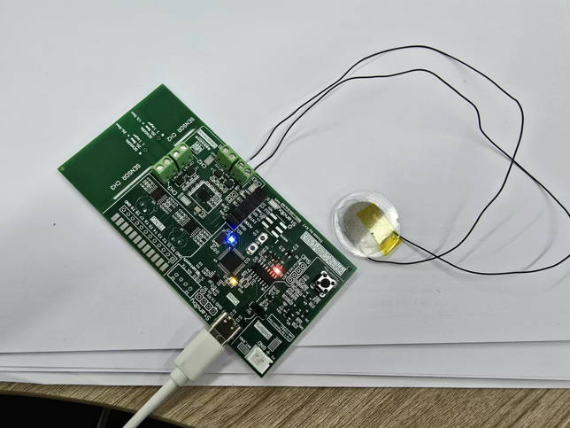

## 项目概述

本项目开发了一种**电容与摩擦电纳米发电机（TENG）多模态检测系统**，用于多个应用场景。系统包括嵌入式硬件与软件组件，以及用于数据可视化和分析的上位机软件接口。

### 系统组成：

- **下位系统：STM32 微控制器（STM32F103C8T6）**
  - **TENG检测**：TENG传感器通过运算放大器与STM32的内置ADC进行连接，实现模拟信号的数字化转换。
  - **电容传感**：系统采用**FDC2214**电容传感器IC，利用电容变化进行检测。
  - **FreeRTOS**：下位机使用FreeRTOS操作系统，提供任务调度与同步，确保传感器数据的高效处理。
  - **数据处理**：嵌入式系统在传感器数据传输至上位机前，应用**FIR滤波**对ADC读取值进行平滑和处理。
- **上位系统：基于C++/QT的界面**
  - **数据可视化**：采用C++和QT开发图形用户界面（GUI），实时显示传感器数据。
  - **数据记录与分析**：系统支持传感器数据的记录，并允许进行FFT等频域分析。

- **硬件设计**：
  - 项目包括多种电路原理图和PCB设计文件，用于STM32与FDC2214和TENG传感器的接口设计。这些文件位于`Hardware`目录中。
- **软件设计**：
  - **STM32软件**：包括核心库、外设驱动和FreeRTOS配置，用于控制硬件传感器。
  - **数据处理软件**：使用Python编写的数据处理脚本，用于对传感器数据进行FIR滤波和FFT变换。
- **文档与参考资料**：
  - 项目包含与关键硬件组件（如FDC2214、TENG传感器、STM32微控制器）相关的数据手册、设计笔记和应用文档。

------

### 项目目录结构：

- **Hardware**：包含所有硬件设计文件，包括电容传感器、TENG接口和STM32控制板的原理图与PCB布局文件。
- Software：
  - **DataProcess**：Python脚本用于数据分析，包括FIR滤波和FFT处理。
  - **Oscilloscope**：基于QT的实时数据可视化软件，支持与STM32的串口通信。
  - **STM32**：STM32固件源码，包括驱动、外设库及FreeRTOS配置。
- **REF**：硬件组件的文档、数据手册及应用笔记，包括FDC2214和STM32微控制器的相关资料。

------

### 项目特色：

- **多模态检测**：集成电容传感和TENG检测于一体，提供多种传感数据。
- **实时数据处理**：利用FreeRTOS进行并发处理，确保实时响应。
- **数据可视化**：提供友好的界面，实时显示传感器数据并支持数据分析。
- **可扩展性**：系统可以轻松扩展，增加新的传感器或功能，满足未来的应用需求。

