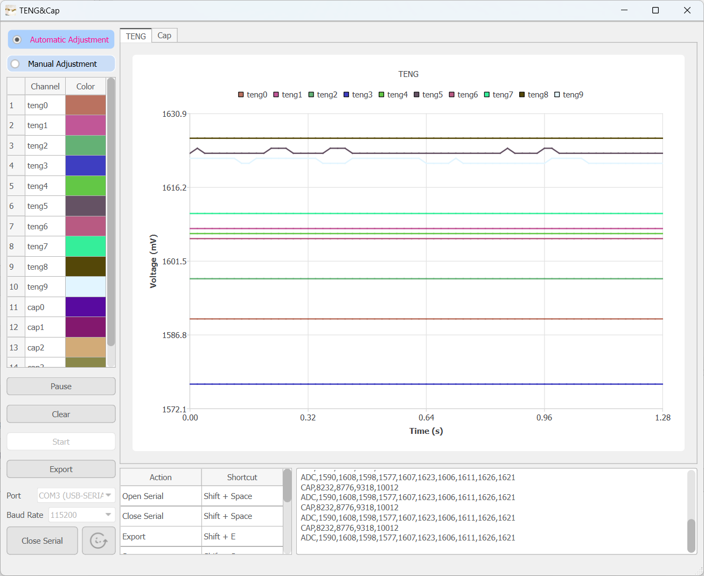

### Project Requirements: Serial Oscilloscope

**Project Overview**: This project aims to develop a full-featured serial oscilloscope for receiving and displaying serial port data, including waveform data and non-waveform data. The oscilloscope needs to be able to process data in a specified format and realize flexible display and analysis of CAP (capacitance) and ADC (analog-to-digital conversion) data.

#### 1. **Data Input and Format**

- **Input Data Format**:

```
CAP,9089,8800,9248,9903
ADC,1589,1610,1600,1577,1606,1621,1605,1609,1619,1618
```

- Each line of data starts with CAP or ADC, followed by multiple comma-separated values.

- **Data Type**:

- `CAP` data represents the capacitance value in picofarads (fF).
- `ADC` data represents the result of analog-to-digital conversion in volts (V).

- **Data processing rules**:

- Each received value needs to be divided by 3 when displayed and converted to decimal form for easy reading and analysis.

- The data refresh rate is **50Hz**, that is, data is obtained from the serial port once every 20ms.

#### 2. **Basic functional requirements**

- **Real-time data drawing**:
- It can display the waveform of the data received by the serial port in real time, providing a clear and stable waveform view.
- It supports waveform drawing of CAP and ADC type data, and allows users to choose to display CAP, ADC or both at the same time according to their needs.
- **Non-waveform data display**:
- When receiving data, in addition to drawing waveforms, the undrawn raw data content can be displayed on the screen.

#### 3. **Adaptability and adjustability**

- **Adaptive display**:
- The system can automatically adjust the display range and scaling to ensure that the waveform can be displayed correctly at different amplitudes.
- **Adjustable settings**:
- Users can manually set the number of channels displayed for CAP and ADC:
- The maximum number of CAP channels is 4.
- The maximum number of ADC channels is 10.
- More than the above is OK, but performance is not guaranteed.
- Users can configure display features, such as:
- Time axis scaling.
- Waveform color, line style, etc.

#### 4. **Interaction and labeling functions**

- **Data selection labels**:
- Provide labels or options on the user interface to allow users to choose to display CAP data, ADC data, or a combination of the two.
- **User interaction**:
- Support simple user interactions, such as switching display modes, pausing/resuming waveform updates, etc.
- Provide shortcut key operations.

#### 5. **Performance and optimization**

- **Data refresh rate**:
- Support data updates with high refresh rates (50Hz) to ensure real-time display without delay.
- **Performance optimization**:
- Improve the efficiency of data reception and waveform drawing through multi-threading or asynchronous processing to avoid interface freezes.
- **Stability**:
- Handle noise and abnormal data to ensure stability and accuracy of display.

#### **6. Data classification export:**

- Generate and export as Excel file according to data type (ADC or CAP).
- Users can choose to export CAP data or ADC data, or export both types of data at the same time.
- The exported Excel file should contain timestamp, data type, original data value and processed data divided by 3.

- **Export format:**
- The Excel file has a clear structure, including data classification tables and appropriate annotations to facilitate subsequent analysis and use by users.

#### 7. Software display

